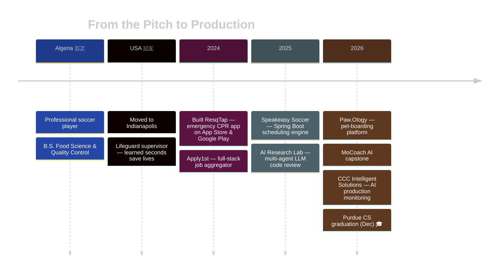

<div align="center">

<!-- ═══════════════════════ HEADER ═══════════════════════ -->
<h1>Hey, I'm Mouncef Tamda 👋</h1>
<h3>Software Engineer · AI & Full-Stack · Former Pro Footballer</h3>
<p><i>Purdue CS '26 · Indianapolis, IN · Open to New Grad SWE roles</i></p>

<!-- Typing animation -->
<a href="https://git.io/typing-svg">
  
</a>

<br/>

<!-- Social badges -->
<p>
  <a href="https://mounceftamda.com"></a>
  <a href="https://linkedin.com/in/mounceftamda"></a>
  <a href="mailto:mounceftamda1@gmail.com"></a>
  <a href="https://github.com/MouncefMoe"></a>
</p>

<!-- Contribution snake (generated by .github/workflows/snake.yml) -->
<picture>
  <source media="(prefers-color-scheme: dark)" srcset="https://raw.githubusercontent.com/MouncefMoe/MouncefMoe/output/github-snake-dark.svg"/>
  <source media="(prefers-color-scheme: light)" srcset="https://raw.githubusercontent.com/MouncefMoe/MouncefMoe/output/github-snake.svg"/>
  
</picture>

</div>

<!-- ═══════════════════════ ABOUT ═══════════════════════ -->
## 🧑‍💻 About Me

```typescript
const mouncef = {
  name:        "Mouncef Tamda (Moe)",
  location:    "Indianapolis, IN 🇺🇸  ←  Algeria 🇩🇿",
  education:   "B.S. Computer Science @ Purdue University — Dec 2026",
  currentRole: "Software Engineering Intern @ CCC Intelligent Solutions",
  building:    "AI monitoring tool that diagnoses production failures and drafts the fix",
  languages:   ["English", "French", "Arabic", "Berber", "Algerian"],
  funFact:     "Former professional soccer player who traded cleats for code ⚽→💻",
  lookingFor:  "New Grad Software Engineer roles — starting Jan 2027",
};
```

> *"I went from reading defenders to reading stack traces — both require quick thinking under pressure."*

<br/>

<!-- ═══════════════════════ NOW ═══════════════════════ -->
## ⚡ What I'm Doing Now

<table>
<tr>
<td width="50%" valign="top">

### 🏢 CCC Intelligent Solutions
**Software Engineering Intern** · Jun 2026 – Present

Building an **AI production-monitoring tool** in Java / Spring Boot that scans Elasticsearch logs across Kubernetes namespaces, rebuilds stack traces, pulls the implicated source from GitHub, and diagnoses root cause with **Claude on AWS Bedrock** — then opens the pull request and Jira ticket for engineers to review.

`Java` `Spring Boot` `AWS Bedrock` `Elasticsearch` `PostgreSQL` `React` `Kubernetes`

</td>
<td width="50%" valign="top">

### 🕌 Dhimmah — Founder
**Flutter · Supabase · PostgreSQL** · Ongoing

A bilingual iOS/Android app combining Fajr alarms, prayer-streak tracking, and a gamified virtual garden to help users build consistent daily prayer habits. Row-Level Security, Deno Edge Functions, home-screen widgets, and 217 automated test files.

`Flutter` `Supabase` `Deno` `RLS` `Widgets`

</td>
</tr>
</table>

<br/>

<!-- ═══════════════════════ EXPERIENCE ═══════════════════════ -->
## 💼 Experience

| When | Where | What |
|:--|:--|:--|
| **Jun 2026 – Now** | **CCC Intelligent Solutions** — SWE Intern | AI monitoring tool · LLM diagnosis · PostgreSQL + S3 · React dashboard · 1,400+ tests |
| **Jan – Jun 2026** | **Paw.Ology** — Full-Stack Engineer Intern | Pet-boarding platform · 24 feature modules · Apple/Google Pay · real-time messaging · 41 migrations, 0% data loss |
| **Aug – Dec 2025** | **Mukhopadhyay AI Research Lab** — AI Research Assistant | Multi-agent code-review system · 72% fewer defects · coverage 38% → 91% · hallucination rate −40% |
| **Jun – Aug 2025** | **Speakeasy Soccer** — SWE Intern | Spring Boot scheduling engine · 15+ teams · scheduling time −90% · 85% test coverage |

<br/>

<!-- ═══════════════════════ PROJECTS ═══════════════════════ -->
## 🚀 Featured Projects

<div align="center">

| | Project | Stack | Highlight |
|:-:|:--|:--|:--|
| 🤖 | **AI Monitoring Tool** | Java · Spring Boot · Bedrock · Elasticsearch · React | Logs → root cause → verified patch → pull request |
| ⚽ | **MoCoach AI** — Capstone | Python · FastAPI · PostgreSQL · Flutter | AI training & recovery plans that adapt to each player |
| 🐾 | **Paw.Ology** | Flutter · Supabase · Edge Functions | Booking engine with overlap detection & payments |
| 🕌 | **Dhimmah** | Flutter · Supabase · Deno | Bilingual prayer-habit app for iOS & Android |
| 🏥 | **ResqTap** | Spring Boot · Java · AWS RDS · Cognito | Real-time CPR guidance — on App Store & Google Play |
| 💼 | **Apply1st** | C# · ASP.NET Core · PostgreSQL | Job aggregator serving 10,000+ listings, 60% faster |

</div>

<br/>

<!-- ═══════════════════════ TECH STACK ═══════════════════════ -->
## 🛠️ Tech Stack

<div align="center">

#### Languages


#### Frameworks


#### Cloud · Data · DevOps


<br/>


</div>

<br/>

<!-- ═══════════════════════ JOURNEY ═══════════════════════ -->
## 🌍 My Journey



<br/>

<!-- ═══════════════════════ STATS ═══════════════════════ -->
## 📊 GitHub Stats

<div align="center">

<!-- 3D contribution graph (generated by .github/workflows/3d-contrib.yml) -->


<br/>

<!-- Summary cards (generated by .github/workflows/summary-cards.yml) -->


<br/><br/>


</div>

<br/>

<!-- ═══════════════════════ CONNECT ═══════════════════════ -->
<div align="center">

## 💬 Let's Connect

*Actively looking for **New Grad Software Engineer** roles starting **January 2027**.*<br/>
*Open to full-time roles in backend, full-stack, and AI/LLM engineering.*

<br/>

<a href="https://linkedin.com/in/mounceftamda"></a>
<a href="mailto:mounceftamda1@gmail.com"></a>
<a href="https://mounceftamda.com"></a>

<br/><br/>


</div>
